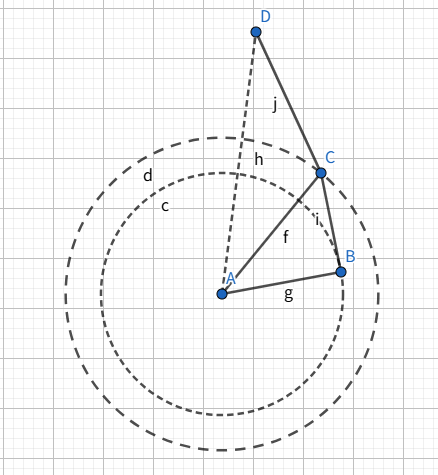

# 基于可持久化的区间ANNS算法

## 研究背景+相关工作
### 问题介绍
基于图的最近邻向量搜索已经被广泛研究，有些情况下，我们需要在一部分受限制的向量子集上进行搜索，常见的一类情况是向量上附带额外的信息，如时间戳信息，此时我们在进行向量搜索的时候，往往需要限制搜索的向量附加信息在一段区间中，如限制搜索最近一段时间区间内的向量。

定义一个时间函数 $\phi(x),x\in C$，经过时间限制得到的 $R_\phi=\{x\in C | \phi(x)\in[l,r]\}$，我们每次需要在 $R_\phi$ 中寻找传统向量最近邻问题的答案。

现有方法（如SeRF、iRangeGraph）存在两大缺陷：
静态索引：不支持动态数据更新（插入/删除），需全量重建索引，成本高昂。

效率与质量权衡：预过滤（Prefiltering）扫描开销大，后过滤（Postfiltering）召回率低，专用索引（如SeRF）空间复杂度高（$O(n^2)$）。

信息冗余：基于线段树等数据结构维护的区间信息需要建额外的图，存储空间冗余

### 相关工作
Segment: Peng 等人首次研究了流式场景下的范围过滤近似最近邻搜索问题。现有方法（如 SeRF、iRange）依赖静态数据集且需预先按属性排序，难以支持任意顺序到达的动态数据流。为此，作者提出动态段图（Dynamic Segment Graph） 结构，用类似线段树的数据结构在属性维度上维护区间，结合矩形合并（MBR）、单次 ANN 搜索等优化，该方法在动态/静态场景下均显著优于基线，实现了线性索引大小增长与次线性查询延迟增长。

DIGRA：Jiang等人提出的动态多路树结构，基于属性$\phi$构建类B树结构，每个节点$u$存储子树内对象的NSW图索引$u.G$。支持分裂（split）与合并（merge）操作，高效处理动态更新。对任意查询范围$Q=[\ell, r]$，定位至多两个节点$u$和$v$，使得$O_Q \subseteq O_u \cup O_v$。保证$ |O_u \cup O_v| / |O_Q| \leq 4B$（$B$为树分支因子），避免扫描$O(B\log n)$节点。


## 背景知识

### 图index算法介绍
NSW, HNSW, NSG等

### 算法思路
传统算法中，图信息和区间信息较为分离，导致往往需要多次重复搜索的信息，或者在搜索的过程中无法充分利用区间信息。受此启发，我们考虑到图中的边在tag顺序信息中的表现性质，构造了可持久化双边单调网络。

### 可持久化双边单调网络
可持久化双边单调网络主要分为两个部分，一个部分是每个点仅存储tag小于等于自己的邻居，并随着tag逐渐变小而在可持久化数据结构上执行类似MRNG的贪心剪枝算法。另一个部分相反，是每个点存储tag大于等于自己的邻居，并随着tag变大而执行剪枝过程。此处的剪枝过程是基于可持久化数据结构特殊调整过的剪枝条件，以保证在取出一个子集时不会丢失其理论单调性，这两个部分合并组成了可持久化双边单调网络。


## 理论
### 乱序单调网络构建
由于我们需要在图的邻居里结合时序信息，因此我们对边进行按时间排序，随后对这些边进行扫描，每次添加边$(u,v)$的时候，我们检查前面是否存在任意一条前面的边$(u,w)$满足$max(dis(u,w),dis(v, w)) < dis(u, v)$，若存在则这条边不予添加，否则就将这条边加入到邻居集合中。这样的加边方式从理论上能保证最后生成的图网络具有单调性。
```
function prune(u, id)
begin
    result = []
    for i in 1..|id| begin
        for j in 1..i-1
            v = id[i]
            w = id[j]
            if dis(u,v)<max(dis(u, w), dis(w, v))
                result.append(v)
    end
    return result
end
```

### 单调性保障
我们可以从任意一边的可持久化数据结构中取出一个含有任意l~mid或mid~r的邻居子集，这两个邻居子集合并起来得到仅包含l~r的向量邻居子集，并且理论上该子集必然是仅在l~r区间的向量上建图后得到的邻居集合的超集，这就从理论上保证了该算法的单调性。

### 可持久化时序剪枝
对于每个时间区间，我们取出邻居中符合条件的集合作为时序上的邻居，对于这些邻居，我们进行反向扫描，对于任意一条边$(u,v)$，若存在它后面的边$(u,w)$满足$max(dis(u,w),dis(v, w)) < dis(u, v)$，则将这条边放入$(u,w)$的候选替代边集合中，而是用于后续剪枝使用，在搜索的时候不直接进行搜索计算。

## 近似双边单调网络算法
## 构建算法

### NSW base
类似NSW的构建算法，按照tag顺序进行插入并实时执行可持久化的剪枝策略，候选邻居子集选择beam search算法的候选人集合+tag相近的向量，共同参与构建。邻居选择算法是排序后动态插入，并执行动态可持久化的剪枝策略，扫描区间并判断向量是否可插入。

```
function build_top(index, phi, D, sorted_id) 
begin
    for i in 1 -> n begin
        candidate = beam_search_candidates(i - D, i)
        canditate.join(sorted_id[i - D .. i])
        neighbour[i] = prune(candidate)
    end
end
```
```
function build(index, phi, D) 
begin
    id_top = id sort by phi(i)
    top_neighbour = build_top(index, phi, D, id_top)
    id_down = id sort by -phi(i)
    down_neighbour = build_top(index, phi, D, id_down)
    for i in 1 -> n begin
        neighbour[i] = top_neighbour + down_neighbour
    end
end
```

### NSG base
类似NSG的构建算法，先进行KNN聚类，随后每次从tag附近的向量执行beam search然后选择候选人集合执行构建
```
function build(index, phi, D) 
begin
    sorted_id = id sort by phi(i)
    g = build_KNNG(index)
    for i in 1 -> n begin
        candidate = beam_search_candidates(i - 1, i)
        candidate.join(sorted_id[i - D, i + D])
        candidate.join(g.neighbour[i])
        neighbour[i] = prune(candidate)
    end
end
```


## 搜索算法
每次搜索的过程中，首先从路由节点集合中选取对应区间中的起点，随后每次从图的可持久化数据结构中截取出符合l~r区间的邻居切片合并得到区间图邻居，在形成的区间图上执行beam search.

## 算法调优
### 向量计算
$dis(A, B) = norm(A)^2+norm(B)^2 - 2AB$
分段计算向量距离，如果中途出现距离超出合法范围就break

### 搜索优化
搜索过程中，先直接搜索未剪枝点，如果某个未剪枝点的距离比当前点更远，则选择它的替代边再次检查，因为替代边是在大部分普通边的方向上更劣的边，但是这条边可能会出现在别的方向的单调网络中，因此我们在普通边不优的时候可以加入替代边再次检查。



## 实验
sift_1m上构建速度和未filtered的算法相当


### 新想法

+ 图的单调性

+ 邻域+KNNG+？ 如何才能保证最终图的单调性被保留并使用？

+ 查询routing优化，routing随着查询区间端点的偏移而移动的范围并不大